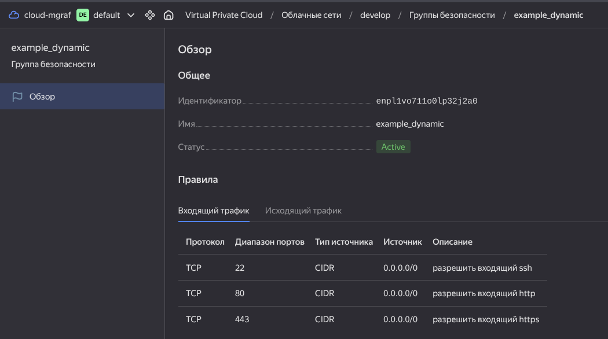
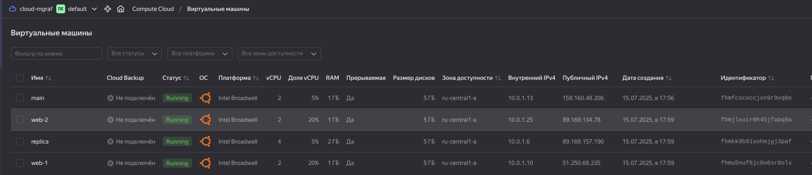
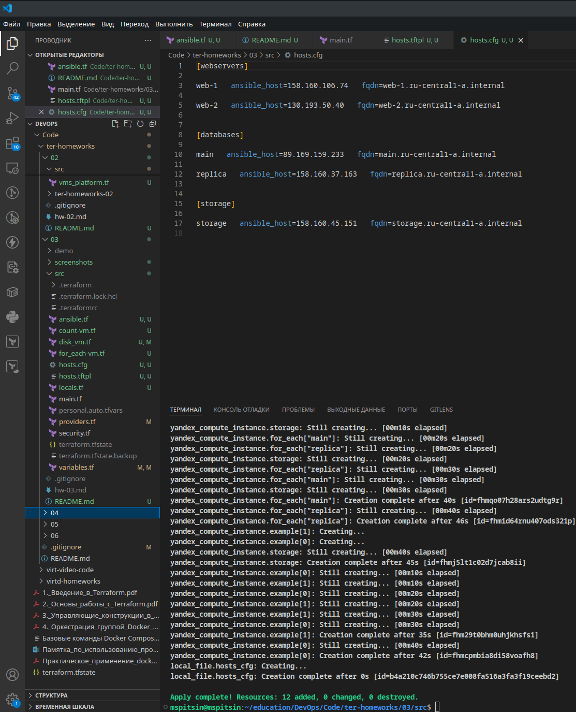
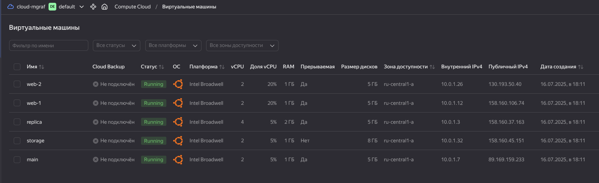

# Домашнее задание к занятию «Управляющие конструкции в коде Terraform»

## Решение задания 1  
- скриншот входящих правил «Группы безопасности» в ЛК Yandex Cloud: 
    
    
## Решение задания 2  
   

## Решение задания 3  
3.1 Создал 3 одинаковых виртуальных диска размером 1 Гб с помощью ресурса yandex_compute_disk и мета-аргумента count в файле `disk_vm.tf`:  

```yaml
resource "yandex_compute_disk" "vm_disks" {
    name = "disk-${count.index + 1}"
    type = "network-hdd"
    size = 1
    count = 3
}
```  
3.2 Создал в том же файле одиночную ВМ c именем "storage", используя блок dynamic secondary_disk{..} и мета-аргумент for_each для подключения созданных дисков.  

```yaml
resource "yandex_compute_instance" "storage" {
  name = "storage"
  resources {
    cores = var.storage_resources.cores
    memory = var.storage_resources.memory
    core_fraction = var.storage_resources.core_fraction
  }

  boot_disk {
    initialize_params {
    image_id = data.yandex_compute_image.ubuntu.image_id
    }
  }

  dynamic "secondary_disk" {
   for_each = yandex_compute_disk.vm_disks.*.id
   content {
     disk_id = secondary_disk.value
   }
  }
  network_interface {
     subnet_id = yandex_vpc_subnet.develop.id
     nat     = true
  }

  metadata = var.metadata
}
```  

## Решение задания 4  
4.1 Создал файл `ansible.tf`  

```yaml
resource "local_file" "hosts_cfg" {
    
    filename = "${abspath(path.module)}/hosts.cfg"
    content = templatefile(
        "${path.module}/hosts.tftpl",
      {
        webservers = yandex_compute_instance.example
        databases = yandex_compute_instance.for_each
        storage = [ yandex_compute_instance.storage ]
      }
    )
}
```

4.2 После выполнения кода:  
    
   

